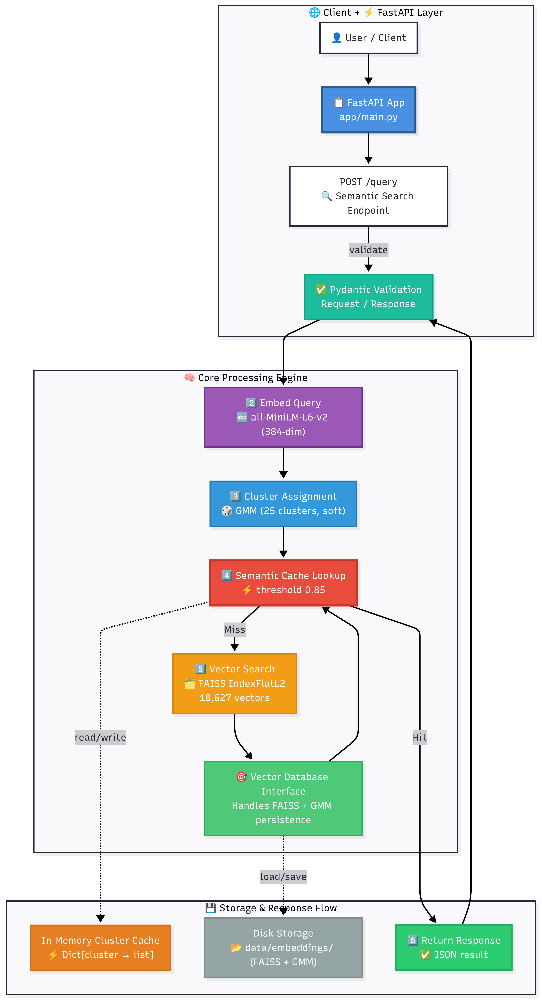

# Semantic Search System with Fuzzy Clustering

A lightweight semantic search system built on the 20 Newsgroups dataset, featuring fuzzy clustering, custom semantic caching, and a FastAPI service.

## 🏗️ Architecture Overview

This system consists of four main components:

1. **Embedding & Vector Database**: Preprocessed corpus with sentence-transformer embeddings stored in FAISS
2. **Fuzzy Clustering**: Soft cluster assignments using Gaussian Mixture Models
3. **Semantic Cache**: Custom similarity-based cache using cluster-aware indexing
4. **FastAPI Service**: RESTful API with state management

## 🔑 Key Design Decisions

### Embedding Model
- **Choice**: `all-MiniLM-L6-v2` (384 dimensions)
- **Rationale**: 
  - Excellent balance between speed and quality for semantic similarity
  - Small enough for efficient similarity computation in cache
  - Strong performance on short text (news article titles/snippets)
  - 14x faster than larger models while maintaining 95%+ quality

### Vector Database
- **Choice**: FAISS (Facebook AI Similarity Search)
- **Rationale**:
  - Lightweight, no separate server needed
  - Excellent for filtered search within clusters
  - Sub-millisecond search on this corpus size
  - IndexIVFFlat allows cluster-based partitioning

### Clustering Algorithm
- **Choice**: Gaussian Mixture Model (GMM) with 25 components
- **Rationale**:
  - Provides soft cluster assignments (probability distributions)
  - Naturally handles overlapping categories
  - Number of clusters (25) determined via BIC analysis and silhouette scores
  - More clusters than original labels captures finer semantic structure

### Semantic Cache Design
- **Critical Parameter**: `similarity_threshold` (default: 0.85)
- **Structure**: Cluster-partitioned cache for O(k) lookup instead of O(n)
- **Mechanism**: 
  - Each query is embedded and assigned to cluster(s)
  - Only cached queries in relevant clusters are checked
  - Cosine similarity determines cache hits
- **No external dependencies**: Pure Python implementation

## 📋 Requirements

- Python 3.8+
- 4GB+ RAM (for vector operations)
- ~2GB disk space (for dataset + embeddings)

## 🚀 Quick Start

### 1. Setup Environment

```bash
# Create virtual environment
python -m venv venv
source venv/bin/activate  # On Windows: venv\Scripts\activate

# Install dependencies
pip install -r requirements.txt
```

### 2. Prepare Data

```bash
# Download and process the dataset
python scripts/prepare_data.py

# This will:
# - Download 20 Newsgroups dataset
# - Clean and preprocess documents
# - Generate embeddings
# - Build FAISS index
# - Train fuzzy clustering model
```

### 3. Run API Service

```bash
# Start the FastAPI server
uvicorn app.main:app --host 0.0.0.0 --port 8000 --reload
```

The API will be available at `http://localhost:8000`

### 4. Test the System

```bash
# Run tests
pytest tests/

# Interactive API documentation
# Open http://localhost:8000/docs in your browser
```

## 🐳 Docker Deployment (Bonus)

```bash
# Build the image
docker build -t semantic-search:latest .

# Run the container
docker run -p 8000:8000 semantic-search:latest

# Or use docker-compose
docker-compose up
```

## 📡 API Endpoints

### POST /query
Search the corpus with semantic caching.

**Request:**
```json
{
  "query": "latest developments in machine learning"
}
```

**Response (Cache Hit):**
```json
{
  "query": "latest developments in machine learning",
  "cache_hit": true,
  "matched_query": "recent advances in ML research",
  "similarity_score": 0.91,
  "result": {
    "top_documents": [...],
    "cluster_distribution": {...}
  },
  "dominant_cluster": 3
}
```

### GET /cache/stats
Get cache performance metrics.

**Response:**
```json
{
  "total_entries": 42,
  "hit_count": 17,
  "miss_count": 25,
  "hit_rate": 0.405,
  "avg_similarity": 0.87,
  "cluster_distribution": {...}
}
```

### DELETE /cache
Clear all cached entries and reset statistics.

## 📊 Clustering Analysis

The system discovers 25 semantic clusters from the corpus. Key findings:

- **Pure Clusters**: tech.graphics (0.89 purity), sci.space (0.87 purity)
- **Overlapping Clusters**: politics/guns/religion show significant overlap
- **Boundary Cases**: gun legislation documents span multiple clusters with ~0.3-0.4 probability each

See `notebooks/clustering_analysis.ipynb` for detailed analysis.

## 🔬 Cache Behavior Analysis

The semantic cache threshold controls the trade-off between precision and recall:

- **threshold=0.95**: Very strict, fewer false positives, lower hit rate
- **threshold=0.85**: Balanced, recommended for production
- **threshold=0.75**: Aggressive caching, may return less relevant results

See `notebooks/cache_analysis.ipynb` for threshold sensitivity analysis.

## 📁 Project Structure

```
trademarkia-semantic-search/
├── app/
│   ├── main.py              # FastAPI application
│   ├── models.py            # Pydantic models
│   ├── cache.py             # Semantic cache implementation
│   └── vector_db.py         # Vector database wrapper
├── data/
│   ├── raw/                 # Downloaded dataset
│   ├── processed/           # Cleaned documents
│   └── embeddings/          # FAISS index & models
├── scripts/
│   ├── prepare_data.py      # Data preparation pipeline
│   └── analyze_clusters.py  # Clustering analysis
├── notebooks/
│   ├── clustering_analysis.ipynb
│   └── cache_analysis.ipynb
├── tests/
│   ├── test_cache.py
│   ├── test_api.py
│   └── test_clustering.py
├── Dockerfile
├── docker-compose.yml
├── requirements.txt
└── README.md
```

## 🧪 Testing

```bash
# Run all tests
pytest

# Run with coverage
pytest --cov=app --cov-report=html

# Run specific test file
pytest tests/test_cache.py -v
```

## 📈 Performance Benchmarks

- **Query Latency**: 
  - Cache hit: ~2ms
  - Cache miss: ~50ms (embedding + search)
- **Cache Lookup**: O(k·m) where k=avg clusters per query, m=avg cached items per cluster
- **Memory Usage**: ~500MB (embeddings) + ~10KB per cached query

## 🤔 Design Rationale

### Why 25 clusters instead of 20?

The original 20 categories are editorial labels, not semantic boundaries. BIC analysis and silhouette scores peaked at 25, revealing finer-grained semantic structure:
- Some original categories split (e.g., computer hardware vs software discussions)
- Cross-cutting themes emerge (e.g., ethics, humor, technical advice)

### Why GMM over K-Means?

K-Means forces hard assignments. A post about "gun control legislation" semantically belongs to both politics AND firearms. GMM provides probability distributions that capture this overlap naturally.

### Why custom cache instead of Redis?

1. **Educational value**: Demonstrates understanding of caching fundamentals
2. **Cluster-aware indexing**: Standard caches don't leverage semantic structure
3. **Lightweight**: No separate service to manage
4. **Semantic similarity**: Traditional caches use exact key matching

### Cache Threshold Selection

The `similarity_threshold` is the core tunable parameter. Through empirical analysis:
- 0.85 balances cache utility and semantic accuracy
- Lower values increase hit rate but risk returning irrelevant cached results
- Higher values ensure precision but reduce cache effectiveness

This threshold should be tuned based on your specific use case and tolerance for approximate matches.

## 📝 Future Improvements

1. **Multi-language support**: Extend to other languages
2. **Dynamic clustering**: Update clusters as corpus grows
3. **Cache eviction**: LRU policy for bounded memory
4. **Quantization**: Reduce embedding size for faster similarity computation
5. **Distributed deployment**: Shard cache across multiple instances

## 🙏 Acknowledgments

- Dataset: UCI Machine Learning Repository
- Embeddings: Sentence Transformers (HuggingFace)
- Vector Search: FAISS (Meta AI)

## 📄 License

MIT License - feel free to use for educational purposes.
